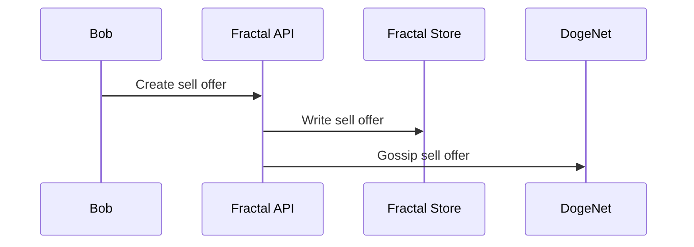
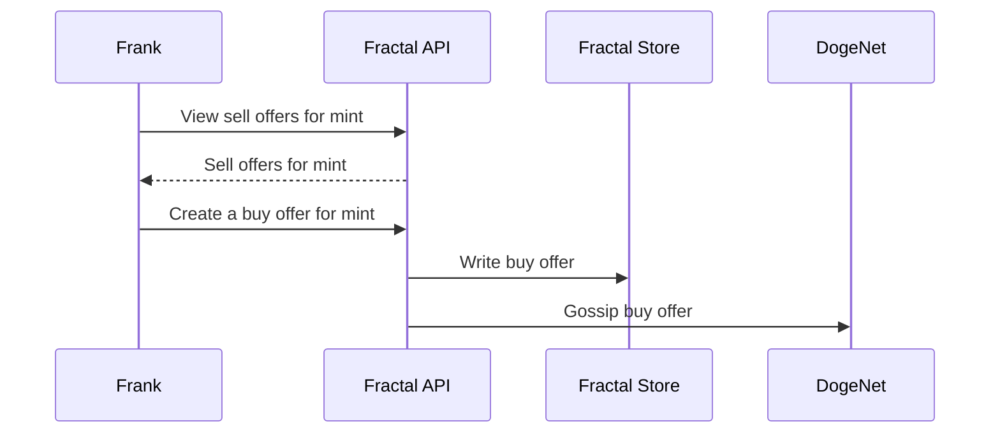
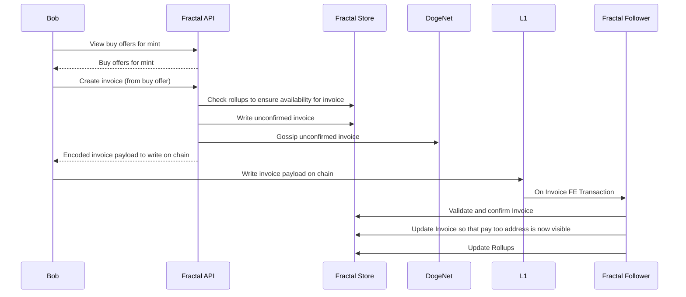
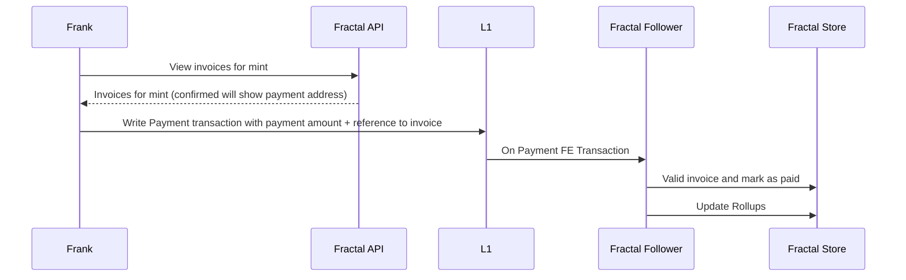

# Selling

## Sell Offer

```mermaid
sequenceDiagram
    Bob->>Fractal API: Create sell offer
    Fractal API->>Fractal Store: Write sell offer
    Fractal API->>DogeNet: Gossip sell offer
```

## Buying

```mermaid
sequenceDiagram
    Frank->>Fractal API: View sell offers for mint
    Fractal API-->>Frank: Sell offers for mint
    Frank->>Fractal API: Create a buy offer for mint
    Fractal API->>Fractal Store: Write buy offer
    Fractal API->>DogeNet: Gossip buy offer
```

## Creating Invoice

```mermaid
sequenceDiagram
    Bob->>Fractal API: View buy offers for mint
    Fractal API-->>Bob: Buy offers for mint
    Bob->>Fractal API: Create invoice (from buy offer)
    Fractal API->>Fractal Store: Check rollups to ensure availability for invoice
    Fractal API->>Fractal Store: Write unconfirmed invoice
    Fractal API->>DogeNet: Gossip unconfirmed invoice
    Fractal API-->>Bob: Encoded invoice payload to write on chain
    Bob->>L1: Write invoice payload on chain
    L1->>Fractal Follower: On Invoice FE Transaction
    Fractal Follower->>Fractal Store: Validate and confirm Invoice
    Fractal Follower->>Fractal Store: Update Invoice so that pay too address is now visible
    Fractal Follower->>Fractal Store: Update Rollups
```

## Paying Invoice

```mermaid
sequenceDiagram
    Frank->>Fractal API: View invoices for mint
    Fractal API-->>Frank: Invoices for mint (confirmed will show payment address)
    Frank->>L1: Write Payment transaction with payment amount + reference to invoice
    L1->>Fractal Follower: On Payment FE Transaction
    Fractal Follower->>Fractal Store: Valid invoice and mark as paid
    Fractal Follower->>Fractal Store: Update Rollups
```

